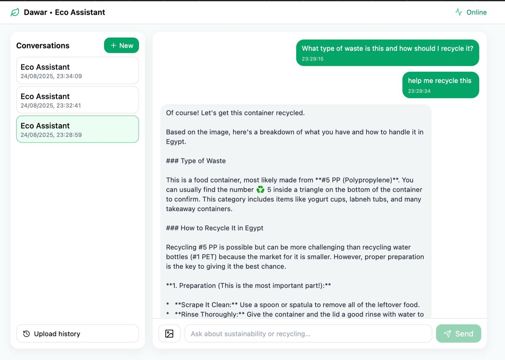

# Dawar Chatbot 

**AI-powered chatbot for waste management and sustainability guidance** — a FastAPI backend that answers questions about recycling, circular economy, and sustainable practices, backed by a pgvector knowledge base, live web search, and an automated newsletter engine.

Dawar exists to make credible sustainability information instantly accessible. Instead of forcing users to dig through fragmented resources, it combines a curated knowledge base with real-time web retrieval and Google Gemini to deliver grounded, conversational answers — and turns that same intelligence into automatically generated, category-driven newsletters.



##  Features

- **Conversational AI Chat**: Streaming chat endpoints powered by Google Gemini (`gemini-2.5-pro`) with persistent conversation history and per-conversation context. Supports optional image input for multimodal analysis.
- **Vector Knowledge Base**: Full CRUD over a knowledge base stored in Postgres with `pgvector`, enabling semantic retrieval to ground responses in trusted content.
- **Automatic Web Search Fallback**: When no local article matches a request, the system transparently falls back to [Exa](https://exa.ai/) semantic search to fetch fresh, relevant sources.
- **Automated Newsletter Engine**: Manage subscribers, generate articles on demand, and send newsletters — built on a **16-category system with 200+ curated sustainability topics** (supply chain circularity, plastic credits, smart waste tech, and more).
- **Observability with LangSmith**: Prompts are pulled from LangSmith (the `dawaragent` prompt) and requests are traced end-to-end for debugging and evaluation.
- **Serverless-ready**: Ships with an AWS Lambda container image (`Dockerfile.lambda`, Mangum adapter) alongside a standard containerized dev setup, plus health/readiness/liveness probes for orchestration.

## 🛠️ Built With

- **Language:** Python 3.11+
- **Web Framework:** FastAPI + Uvicorn (ASGI)
- **AI / LLM:** Google Gemini via LangChain (`langchain`, `langchain-google-genai`), Exa (`langchain-exa`, `exa-py`)
- **Data:** PostgreSQL (Neon) with SQLAlchemy 2.0, `asyncpg`, and `pgvector`
- **Observability:** LangSmith
- **Serverless:** AWS Lambda via Mangum
- **Tooling:** Docker & Docker Compose, Black, Flake8, MyPy, Pytest

## 📦 Installation

Clone the repository and install dependencies:

```bash
git clone https://github.com/rodynaamrfathy/E-Hub.git
cd E-Hub/Chatbot

# Install runtime + dev dependencies (editable)
pip install -e ".[dev]"
```

Then configure your environment:

```bash
cp env.example .env
# Edit .env and set GOOGLE_API_KEY, EXA_API_KEY, LANGSMITH_API_KEY,
# and NEON_DATABASE_URL
```

### Required environment variables

| Variable | Purpose |
|----------|---------|
| `GOOGLE_API_KEY` | Google Gemini API key (LLM + vision) |
| `EXA_API_KEY` | Exa search key for the web-search fallback |
| `LANGSMITH_API_KEY` | LangSmith observability & prompt management |
| `NEON_DATABASE_URL` | PostgreSQL (Neon) connection string |

Optional tuning: `CHATBOT_MODEL` (default `gemini-2.5-pro`), `MAX_HISTORY` (default `50`), `DB_POOL_SIZE`, `CORS_ORIGINS`, `LOG_LEVEL`. See `env.example` for the full list.

## 🖥️ Usage

### Run locally

```bash
python backend/main.py
```

The API starts on `http://localhost:8000`. Interactive docs are available at `http://localhost:8000/docs`, and a health check at `http://localhost:8000/health`.

### Run with Docker

```bash
docker compose up --build
```

### Example: start a conversation and stream a reply

```bash
# 1. Create a new conversation
curl -X POST http://localhost:8000/chat/new \
  -H "Content-Type: application/json" \
  -d '{"title": "Recycling questions"}'

# 2. Send a message and stream the answer
curl -X POST http://localhost:8000/chat/{conv_id}/send-stream \
  -H "Content-Type: application/json" \
  -d '{"message": "How do I recycle lithium batteries safely?"}'
```

### Key endpoints

| Area | Method & Path | Purpose |
|------|---------------|---------|
| Chat | `POST /chat/new` | Start a conversation |
| Chat | `POST /chat/{conv_id}/send-stream` | Send a message, stream the answer |
| Chat | `GET /chat/{conv_id}/history` | Retrieve conversation history |
| Knowledge Base | `GET/POST/PUT/DELETE /kb` | Manage knowledge base entries |
| Newsletter | `POST /newsletter/subscribers` | Add a subscriber |
| Newsletter | `POST /newsletter/articles/generate` | Generate an article (Exa fallback) |
| Newsletter | `POST /newsletter/send` | Send the newsletter |

For feature-specific setup, see `NEWSLETTER_SETUP.md`, `CATEGORIES_SETUP.md`, and `EXA_SETUP_QUICK.md`, plus the deeper guides under `docs/` (architecture, RAG pipeline, streaming, and deployment).

## 🤝 Contributing

Contributions are welcome! To get started:

1. Fork the repository and create a feature branch (`git checkout -b feature/my-feature`).
2. Follow the existing code style — run `black .`, `flake8`, and `mypy` before committing.
3. Add or update tests under `backend/tests/` and ensure `pytest` passes.
4. Open a pull request with a clear description of the change and link any related issues.

For bugs or feature ideas, please open an issue first so we can discuss the approach.

## 📄 License

This project is licensed under the MIT License. See the `LICENSE` file for details.
